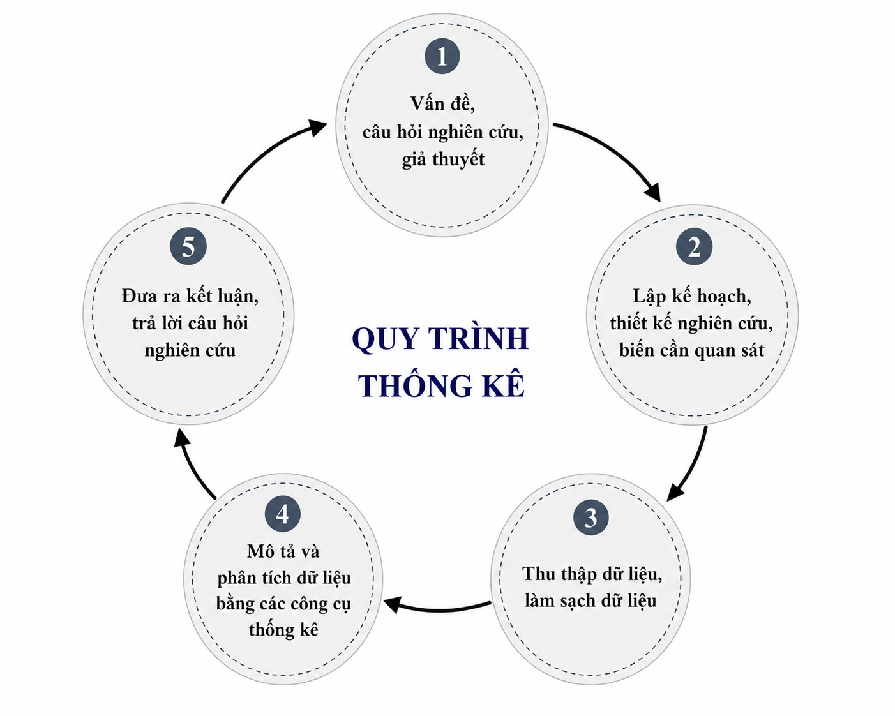
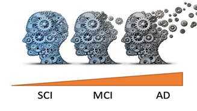
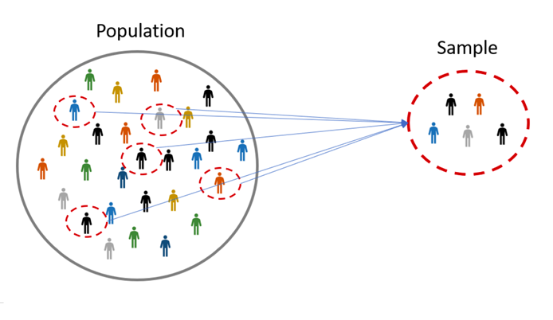
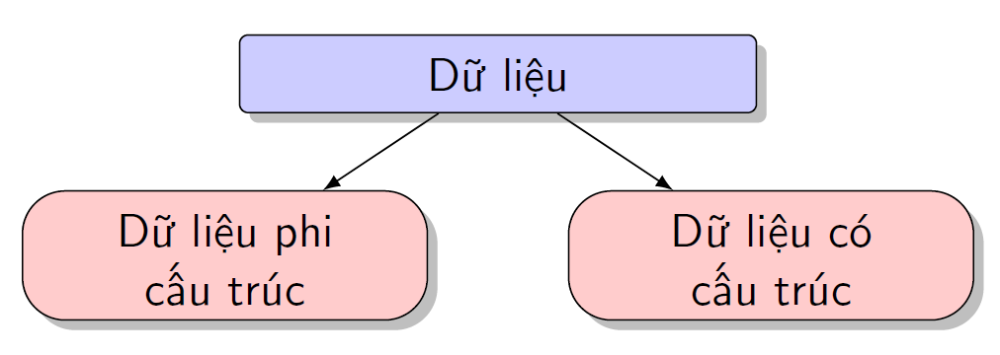
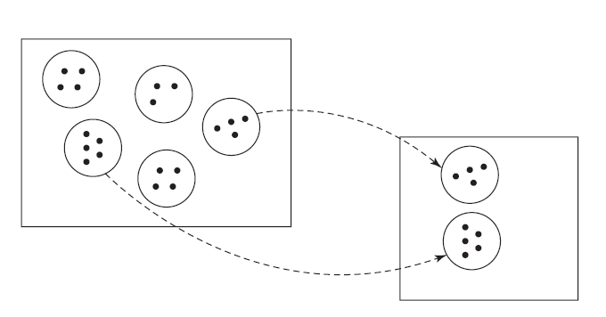
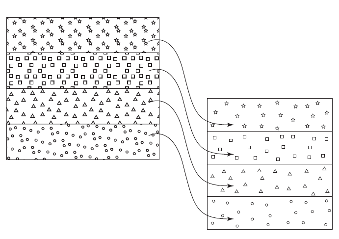

# Dữ liệu Thống kê

## Thống kê
**Thống kê** (*Statistics*) là một ngành khoa học của việc thu thập, phân tích, biểu diễn và giải thích dữ liệu, nhằm tìm ra các bằng chứng để cung cố hoặc bác bỏ các giả thuyết khoa học, với quy trình thống kê khép kín được biểu diễn trong Hình \@ref(fig:quytrinh).

(\#fig:quytrinh)Quy trình thống kê từ đặt vấn đề nghiên cứu đến kết luận.

Một số khái niệm sau cần làm rõ:

* Câu hỏi nghiên cứu là gì?
* Lập kế hoạch cho một nghiên cứu thống kê là gì?
* Ý nghĩa thống kê là gì? và tại sao ta phải sử dụng các phương pháp thống kê trong các vấn đề của sinh học?

Một câu hỏi nghiên cứu là ``một câu hỏi mà một dự án nghiên cứu đặt ra để trả lời''. Trong sinh học, câu hỏi nghiên cứu có thể là:

* sự khác biệt về hình thái giữa cua cái và cua đực, hay cua xanh và cam là gì?
* tại sao mức độ hoạt động của MAO (monoammino oxidase) lại khác nhau giữa các nhóm bệnh nhân tâm thần phân liệt?
* làm thế nào để phân loại các loài hoa iris dựa trên đặc điểm của chúng?
* có sự khác biệt nào giữa 3 loài chim cánh cụt: Adelie, Chinstrap và Gentoo?
* tỷ lệ 3:1 liệu có luôn luôn đúng trong di truyền?
* biểu hiện gen (gene expression) của một số gen có khác nhau giữa người bệnh và người khỏe mạnh?
* và nhiều hơn nữa ...

Lập kế hoạch nghiên cứu là một bước rất quan trọng trong nghiên cứu phân tích dữ liệu. Ta cần làm rõ những yếu tố sau:

1. Đối tượng của nghiên cứu, có thể là, người, động vật, thực vật, tế bào, máy móc, ....
1. Khoanh vùng đối tượng của nghiên cứu, có thể là khu vực sinh sống; mức thu nhập, cơ quan trên cơ thể sinh vật (tim, não, cây, thân, lá), tình trạng sức khỏe.
1. Các biến (ngẫu nhiên) cần được quan sát để phục vụ cho việc phân tích và trả lời câu hỏi nghiên cứu, bao gồm 02 loại biến: biến dạng số hay định lượng (quantitative variable) và biến danh mục hay biến định tính (qualitative variable).
1. Cách thức thu thập dữ liệu (hay mẫu), thường là thông qua quan sát thực tế (observational study) hoặc thông quan các thí nghiệm (experimental study).

Ta xét một số ví dụ sau.

::: {.example #MAO name="Monoamine oxidase (MAO) v.s. bệnh tâm thần phân liệt (schizophrenia)"}
Monoamine oxidase (MAO) là một loại enzyme được cho là có vai trò trong việc điều chỉnh hành vi của não bộ, đặc biệt, nồng độ MAO có thể liên quan tới các tình trạng của bệnh tâm thần phân liệt (schizophrenia), đọc thêm trong @potkin1978paranoid.

Theo thông tin tổng hợp từ bài báo khoa học, ta tổng hợp được các thông tin sau.

1. **Câu hỏi nghiên cứu:** MAO có liên quan tới tình trạng của bệnh nhân tâm thần phân liệt?
1. **Đối tượng nghiên cứu:** bệnh nhân tâm thần phân liệt với các tình trạng khác nhau.
1. **Khoanh vùng đối tượng:** bệnh nhân tâm thần phân liệt tại một khu vực sinh sống nhất định.
1. **Biến cần quan sát:**
    - nồng độ MAO của bệnh nhân tâm thần phân liệt;
    - tình trạng bệnh;
    - độ tuổi;
    - giới tính.
1. **Cách thức lấy mẫu:** quan sát thu thập dữ liệu thực tế.

:::

::: {.example #body name="Kích thước cơ thể và mức tiêu thụ năng lượng"}
Chúng ta thường nghĩ rằng người to/lớn hơn thì sẽ cần nhiều năng lượng hơn. Nhưng liệu điều này có đúng? Để tìm hiểu về mối liên hệ giữa sự tiêu hao năng lượng và khối lượng không mỡ ở nam giới và phụ nữ, @webb1981energy đã thực hiện một nghiên cứu trên 15 nam giới và nữ giới trưởng thành, tuổi từ 22 tới 55. Theo thông tin tổng hợp từ bài báo khoa học, ta có thể rút ra các ý chính sau.

1. **Câu hỏi nghiên cứu**: Nhu cầu đồ ăn có liên quan tới kích thước cơ thể.
1. **Đối tượng nghiên cứu**: người trưởng thành.
1. **Khoanh vùng đối tượng**: người trưởng thành tại một khu vực sinh sống nhất định.
1. **Biến cần quan sát**:
    - trọng lượng cơ thể không có chất béo (the fat-free body mass);
    - năng lương tiêu thụ trong quá trình vận động tĩnh tại (suy nghĩ, đọc sách, nằm nghỉ);
    - tuổi;
    - giới tính.
1. **Các thức lấy mẫu**: thí nghiệm và ghi nhận quan sát dữ liệu thực tế.

:::

::: {.example #AD name="Chuẩn đoán sớm bệnh Alzheimer's"}
Bệnh Alzheimer là một bệnh thoái hoá thần kinh tiến triển, là nguyên nhân phổ biến nhất của chứng sa sút trí tuệ (dementia), đặc trưng bởi sự suy giảm dần về trí nhớ, khả năng tư duy, ngôn ngữ, và kỹ năng thực hành hàng ngày\footnote{\href{https://www.alzint.org/about/dementia-facts-figures/types-of-dementia/alzheimers-disease/}{Dementia facts figures, types of dementia}}. Bệnh tiến triển qua nhiều giai đoạn, từ giai đoạn trước triệu chứng (preclinical), sang giai đoạn rối loạn nhận thức nhẹ (Mild Cognitive Impairment – MCI), rồi tới giai đoạn Alzheimer đã rõ ràng hơn về mặt lâm sàng. Hiện nay chưa có cách chữa khỏi Alzheimer, nhưng nếu phát hiện sớm, có thể can thiệp để làm chậm tiến triển, cải thiện chất lượng cuộc sống. Do đó, việc phát hiện sớm tình trạng bệnh của bệnh nhân có vai trò quan trọng trong y tế. 

(\#fig:ill-AD)Hình minh họa quá trình suy giảm trí nhớ ở các mức độ từ nhẹ tới nặng của bệnh Alzheimer.

@van2023lipidomic tiến hành đánh giá khả năng dự đoán nhóm tình trạng bệnh: suy giảm nhận thức chủ quan - subjective cognitive impairment (SCI), rối loạn nhận thức nhẹ (MCI) và bệnh Alzheimer, của các hồ sơ lipidomic (lipidomic profile) trong dịch não tủy (CSF) của người. Theo thông tin tổng hợp từ bài báo khoa học, ta có thể rút ra các ý chính như sau.

1. **Câu hỏi nghiên cứu**: các giá trị của các loại chất béo (lipid) khác nhau có liên quan tới tiến trình phát triển bệnh?
1. **Đối tượng nghiên cứu**: người trưởng thành có các triệu chứng rõ ràng của ba tình trạng bệnh.
1. **Khoanh vùng đối tượng**: 1 thành phố nhất định.
1. **Biến cần quan sát**:
    - tình trạng bệnh, bao gồm, SCI, MCI và AD;
    - giá trị đo đạc của các lipid trong CFS, ví dụ: phospholipids (PC), phosphatidylethanolamines (PE).
1. **Cách thức lấy mẫu**: thu thập mẫu dịch tủy não của người tham gia và tiến hành phân tích trong phòng thí nghiệm.

:::

::: {.example #Lung name="Small round blue cell tumors (SRBCTs)"}
Small round blue cell tumors (SRBCTs) là một nhóm các khối u ác tính, thường gặp ở trẻ em và thanh thiếu niên, có đặc điểm mô học chung là tế bào nhỏ, hình tròn, nhân đậm màu nên khi nhuộm Hematoxylin–Eosin thường thấy như những ``tế bào tròn xanh'' dưới kính hiển vi. Nhóm này không phải là một loại bệnh đơn lẻ mà bao gồm nhiều khối u khác nhau, điển hình như: Neuroblastoma, Ewing family of tumours, Rhabdomyosarcoma, Burkitt lymphoma \footnote{\href{https://en.wikipedia.org/wiki/Small-blue-round-cell_tumor}{Small blue round cell tumor}}. Việc phân loại được các loại tế bào ôm thư này rất quan trọng trong y tế, giúp cho các bác sĩ có các pháp đồ điều trị phù hợp. @khan2001classification đã tiến hành một nghiên cứu trong đó sử dụng giá trị biểu hiện của 2308 gene (cDNA microarrays) làm chỉ số phân loại 4 nhóm tế bào ung thư. Theo thông tin tổng hợp từ bài báo khoa học, ta có thể rút ra các ý chính như sau.

1. **Câu hỏi nghiên cứu**: giá trị biểu hiện của gene có thực sự khác biệt giữa các nhóm tế bào ung thư SRBCTs?
1. **Đối tượng nghiên cứu**: trẻ em vả thanh thiếu niên bị mắc SRBCTs.
1. **Khoanh vùng đối tượng**: 1 thành phố nhất định.
1. **Biến cần quan sát**:
    - nhóm tế bào ung thư cụ thể;
    - giá trị biểu hiện của các gene liên quan.
1. Cách thức lấy mẫu: thu thập mẫu sinh thiết khối u và mẫu dòng tế bào của người tham gia và tiến hành phân tích gene trong phòng thí nghiệm.

:::

Từ các ví dụ trên, ta nhận thấy rằng các nghiên cứu sinh học dù là trong lĩnh vực nào, cũng phải xuất phát từ một cuâ hỏi nghiên cứu cụ thể và có các bước vạch kế hoạch thiết kế và thu hoạch mẫu cụ thể. Kết quả thu được qua quá trình phân tích thống kê sẽ là củ cố các nghi vấn trước đó hoặc bác bỏ chúng, khi này ta thường nói rằng "*kết quả có ý nghĩa thống kê*". Vậy cụ từ "*ý nghĩa thống kê*" là gì? Một cách kỹ thuật, **ý nghĩa thống kê** là sự quyết định của nhà phân tích thống kê rằng các kết quả trong dữ liệu không phải là hệ quả của một sự may mắn ngẫu nhiên. **Kiểm tra giả thuyết thống kê** là phương pháp mà nhà phân tích đưa ra quyết định này.

## Dữ liệu thống kê

Một dữ liệu thống kê là một bộ *mẫu ngẫu nhiên* của các *đối tượng nghiên cứu*, nó bao gồm các thông tin mô tả *đặc tính của các đối tượng nghiên cứu*. Một bộ dữ liệu có thể được thu được thông qua việc quan sát và thu mẫu thực tế (*observations*), hoặc thu mẫu các đối tượng thông qua các thí nghiệm *experiments*. Một quần thể hay tổng thể (*population*) là bộ dữ liệu lớn bao gồm tất cả đối tượng nghiên cứu có thể được bao hàm trong câu hỏi nghiên cứu, trong khi đó mẫu (*sample*) là 1 phần nhỏ quần thể được lấy ngẫu nhiên và gồm các đối tượng đã được thu thập thông tin dữ liệu phục vụ nghiên cứu (xem Hình \@ref(fig:pop-samp)). Một đối tượng nghiên cứu được coi là một đơn vị thống kê (*statistical unit*). Trong dữ liệu, một tính chất của đối tượng nghiên cứu thường được gán bởi một biến ngẫu nhiên (*random variable*).

(\#fig:pop-samp)Minh họa quần thể (population) và mẫu ngẫu nhiên (sample).

(\#fig:data-type)Sơ đồ phân chia dữ liệu: dữ liệu cấu trúc và dữ liệu phi cấu trúc.

Về mặt kỹ thuật, dữ liệu được phân thành hai dạng: **dữ liệu có cấu trúc** (*structured data*) và **dữ liệu phi cấu trúc** (*unstructured data*), như minh họa trong Hình \@ref(fig:data-type). Trong đó, dữ liệu có cấu trúc được chia thành hai nhóm chính là **biến dạng số** (*numerical variable*) và **biến dạng thể loại** (*categorical variable*). Ngược lại, dữ liệu phi cấu trúc bao gồm hình ảnh, âm thanh, văn bản và video.

Cụ thể, dữ liệu có cấu trúc bao gồm các dạng sau.

Biến dạng số (*numerical variable* hay *quantitative variable*)
:   Là biến ngẫu nhiên có giá trị là các số, dùng để biểu diễn hoặc đo lường đại lượng của đối tượng nghiên cứu. Biến dạng số được chia thành:
    
    - biến liên tục (*continuous variable*);
    - biến rời rạc hay biến đếm (*discrete variable*).

Biến dạng thể loại (*categorical variable* hay *qualitative variable*)
:   Là biến ngẫu nhiên có giá trị là các nhóm hoặc thể loại của đối tượng nghiên cứu. Hai dạng phổ biến là:
    
    - biến định danh (*nominal variable*);
    - biến thứ bậc (*ordinal variable*).

    Riêng đối với biến định danh, có thể phân thành:

    - biến nhị phân (*binary variable*), khi biến chỉ có hai giá trị;
    - biến đa định danh (*multinomial nominal variable* hoặc *multinomial variable*), khi biến có từ ba giá trị trở lên.

::: {.example #data name="..."}
[[*cung cấp ví dụ về dữ liệu có cấu trúc và các dạng biến*]]

:::

## Kỹ thuật thu thập dữ liệu
Về cơ bản ta có ba kỹ thuật lấy mẫu ngẫu nhiên cơ bản sau.

Lấy mẫu ngẫu nhiên đơn giản (*simple random sampling*)
:   Là cách lấy mẫu ngẫu nhiên mà trong đó, ta chọn ngẫu nhiên $n$ đối tượng từ quần thể sao cho mỗi đối tượng chỉ được chọn một lần, với xác suất được chọn là như nhau và các đối tượng được chọn là độc lập với nhau.

Lấy mẫu ngẫu nhiên theo cụm (*cluster random sampling*)
:   Là cách lấy mẫu ngẫu nhiên mà trong đó, ta chọn ngẫu nhiên **toàn bộ** các thành viên của một hoặc nhiều cụm (nhóm) thay vì chỉ chọn từng thành viên riêng lẻ. Xem Hình \@ref(fig:clus-samp).

Lấy mẫu ngẫu nhiên phân tầng (*stratified random sampling*)
:   Là cách lấy mẫu mà trước tiên quần thể được chia thành các tầng (*strata*), trong đó các cá thể trong cùng một tầng có những đặc điểm tương đồng. Sau đó, tiến hành lấy mẫu ngẫu nhiên đơn giản trong từng tầng và kết hợp các mẫu này để tạo thành mẫu cuối cùng. Xem Hình \@ref(fig:straf-samp).

(\#fig:clus-samp)Hình minh họa hai phương pháp lấy mẫu theo cụm.

(\#fig:straf-samp)Hình minh họa hai phương pháp lấy mẫu theo phân tầng.

::: {.example #sampling name="..."}
[[*cung cấp ví dụ về dữ liệu và các lấy tương ứng*]]

:::

### Mô phỏng kết quả phân phối dữ liệu

Dưới đây là ứng dụng Shiny tương tác cho phép thay đổi các tham số trực quan:

<iframe src="https://d4ncgj-th0nh0duy-nguy0n.shinyapps.io/Test/" width="100%" height="600px" data-external="1"></iframe>

Quá là tuyệt vời!!!
