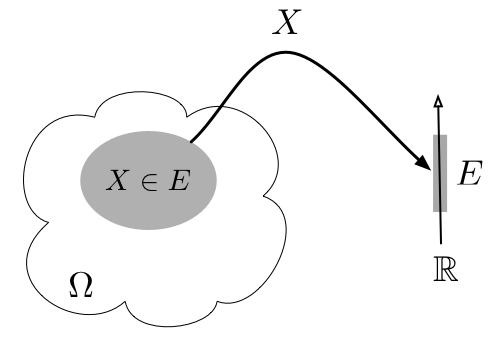
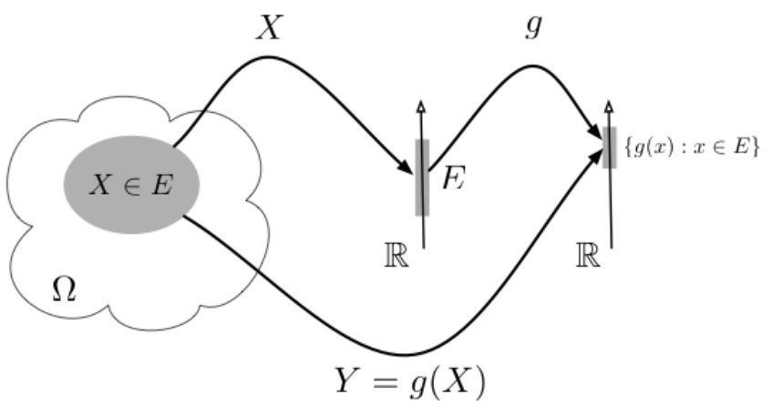

# Biến ngẫu nhiên
Trong phần này, chúng ta sẽ ôn lại các khái niệm cơ bản của biến ngẫu nhiên, vector ngẫu nhiên, cũng như các đặc trưng quan trọng của chúng. Các kiến thức này sẽ là nền tảng cho sự kết nối giữa dữ liệu và biến ngẫu nhiên, qua đó, giúp ta thuận lợi xây dựng các công cụ thống kê cho việc biểu diễn và phân tích dữ liệu.

## Biến ngẫu nhiên

### Định nghĩa biến ngẫu nhiên
Xét một phép thử ngẫu nhiên có không gian mẫu $\Omega$. Gọi $\omega$ là một biến cố sơ cấp (hay **kết quả** của phép thử) thuộc $\Omega$. Khi đó, ánh xạ

$$
\begin{aligned}
X &: \Omega \rightarrow \mathbb{R},\\
 & \omega \mapsto X(\omega)
\end{aligned}
$$
được gọi là **biến ngẫu nhiên** (*random variable*).

Một hàm của một hay nhiều biến ngẫu nhiên là một ánh xạ
$$
Y = g(X_1, \ldots, X_p),
$$
trong đó $g$ là một hàm xác định trên giá trị của các biến ngẫu nhiên. Khi đó $Y$ cũng một biến ngẫu nhiên, và $g$ được gọi là **hàm của biến ngẫu nhiên** (*function of random variable*). Xem minh họa trong Hình \@ref(fig:rva)(a) và \@ref(fig:rva)(b).

(\#fig:rva)Minh họa biến ngẫu nhiên và hàm của biến ngẫu nhiên.

Xét theo miền giá trị của biến ngẫu nhiên, ta phân thành hai loại cơ bản là **biến ngẫu nhiên rời rạc** (*discrete random variable*) và **biến ngẫu nhiên liên tục** (*continuous random variable*).

Biến ngẫu nhiên **rời rạc** là biến ngẫu nhiên chỉ nhận các giá trị rời rạc, chẳng hạn như các số tự nhiên hoặc số nguyên, với tập giá trị có thể hữu hạn hoặc vô hạn đếm được. Ví dụ: số vết xước trên một bề mặt, số bộ phận bị lỗi trong 1000 bộ phận được kiểm tra hoặc số bit truyền nhận bị lỗi.

Ngược lại, biến ngẫu nhiên **liên tục** là biến ngẫu nhiên có thể nhận mọi giá trị trong một khoảng của trục số thực $\mathbb{R}$ hoặc trên toàn bộ trục số thực. Ví dụ: chiều dài, áp suất, nhiệt độ, thời gian, điện áp và trọng lượng.

### Phân phối xác suất
Trong lý thuyết xác suất, cũng như trong áp dụng thực tế, ta thường quan tâm tới các sự kiện liên quan tới việc quan sát được một tập giá trị $A$ của biến ngẫu nhiên $X$. Khi đó, xác suất xảy ra sự kiện $X \in A$, tức là $\Pr(X \in A)$, là đại lượng quan tâm. Trong phần này, ta sẽ điểm qua các khía niệm quan trọng của $\Pr(X \in A)$ tương ứng các trường hợp rời rạc và liên tục.

::: {.definition #pmf name="Hàm xác suất của biến ngẫu nhiên rời rạc"}
Xét biến ngẫu nhiên rời rạc $X$ có các giá trị có thể là $x_1,x_2,\ldots,x_k$.

**Hàm trọng lượng xác suất** (*probability mass function*, PMF) của $X$ là hàm
$$
p(x_i) = \Pr(X=x_i),
$$

thỏa mãn các điều kiện

- $0 \le p(x_i) \le 1$ với mọi $i$;
- $\sum_{i=1}^{k} p(x_i)=1.$

Hàm phân phối tích lũy (*cumulative distribution function*, CDF) của $X$ được định nghĩa bởi

$$
F(x) = \Pr(X\le x) = \sum_{x_i\le x} p(x_i).
$$

Hàm $F(x)$ luôn thỏa mãn

- $0\le F(x)\le1$;
- nếu $x\le y$ thì $F(x)\le F(y)$.

:::

Trong một số trường hợp, hàm xác suất $p(x)$ có thể được biểu diễn bằng một công thức tường minh. Tuy nhiên, đối với nhiều biến ngẫu nhiên rời rạc, hàm xác suất chỉ được cho dưới dạng **bảng phân phối xác suất**.

::: {.definition #pdf name="Hàm xác suất của biến ngẫu nhiên liên tục"}

Hàm miêu tả mật độ tập trung của một biến ngẫu nhiên liên tục $X$ trong không gian giá trị $\mathcal{X}$, được gọi là *hàm mật độ xác suất*, ký hiệu là $f(x)$, với các tính chất sau:

- $f(x)$ là khả tích;
- $f(x) \ge 0$, với mọi giá trị của $x$;
- $\displaystyle{\int_{\mathcal{X}}} f(x) \, \mathrm{d} x = 1$;
- $\Pr(a \le X \le b) = \displaystyle{\int_{a}^{b}} f(x) \, \mathrm{d} x$, tức là diện tích phía dưới đường cong xác định bởi hàm $f(x)$ trong khoảng $[a, b]$ của $X$.

Hàm mật độ xác suất $f(x)$ được mô tả theo công thức tường minh. Hàm phân phối tích lũy của biến ngẫu nhiên liên tục $X$ được định nghĩa bởi:
\[
F(x) = \Pr(X \le x) = \int\limits_{-\infty}^{x} f(s) \, \mathrm{d} s.
\]
Ta có một số tính chất của $F(x)$ như sau:

- $F(x)$ là hàm liên tục, khả vi;
- đạo hàm của $F(x)$ là $f(x)$, tức là $\dfrac{\mathrm{d} F(x)}{\mathrm{d} x} = f(x)$.

:::

### Các đặc trưng

## Vector ngẫu nhiên 

### Hàm phân phối đồng thời

### Các đặc trưng của vector ngẫu nhiên

### Hàm phân phối lề

### Hàm phân phối điều kiện

## Sự độc lập

